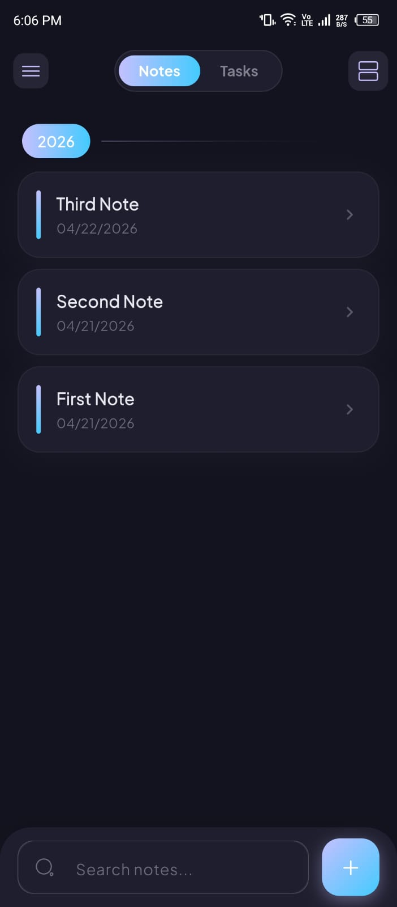
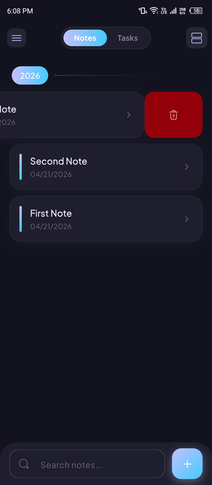
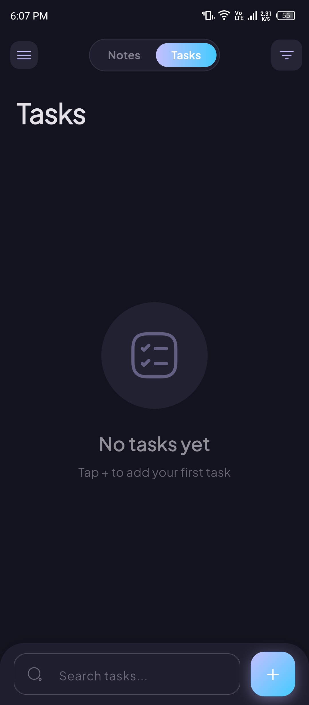
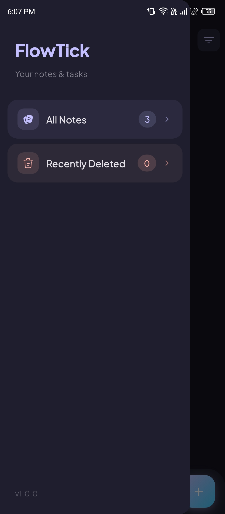
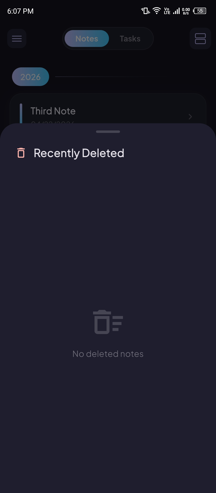
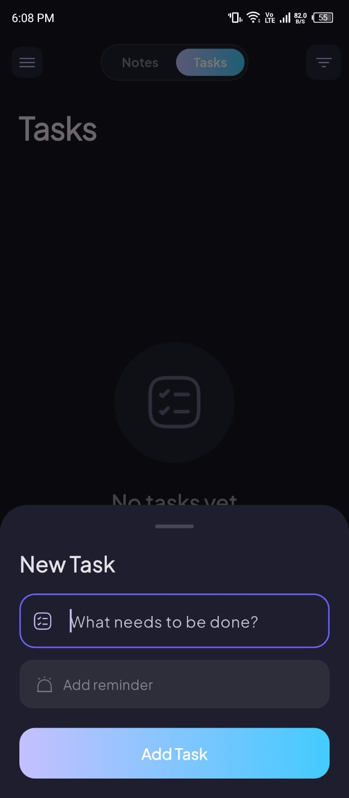
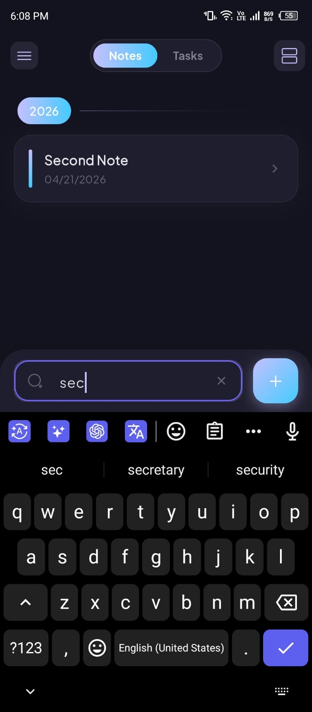

# FlowTick 📝✅

<div align="center">



**A beautifully designed Flutter productivity app for managing notes and tasks.**  
Built with Firebase, Riverpod, and a stunning modern animated UI.

[](https://flutter.dev)
[](https://firebase.google.com)
[](https://riverpod.dev)
[](LICENSE)

</div>

---

## 📸 Screenshots

<div align="center">

| Notes — List View | Notes — Swipe Delete | Tasks Screen |
|:---:|:---:|:---:|
|  |  |  |

| App Drawer | Recently Deleted | Add Task Sheet | Search |
|:---:|:---:|:---:|:---:|
|  |  |  |  |

</div>

---

## ✨ Features

### 📝 Notes
- Create, edit and delete notes with title & rich content
- Attach images from gallery to any note
- **3 view modes** — List, Card and Grid
- Notes grouped by year with animated gradient section headers
- Soft delete with **Recently Deleted** bottom sheet for recovery
- Permanent delete option
- Swipe left on any note to delete instantly
- Real-time search across all notes

### ✅ Tasks
- Add tasks with optional reminder date & time
- Local push notifications sent to your device when reminder time arrives
- Animated checkbox to mark tasks as completed
- Strikethrough style on completed tasks
- Sort by **Latest** or **Reminder Time**
- Swipe to delete any task
- Real-time search across all tasks

### 🎨 UI & UX
- Stunning dark & light mode with automatic system detection
- Smooth staggered list animations powered by `flutter_animate`
- Gradient accents, glowing FAB, animated tab switcher
- Bottom search bar that floats above the keyboard while typing
- App drawer showing live note counts
- Clean empty states with elastic scale animations
- Rounded cards with subtle shadows throughout

---

## 🛠 Tech Stack

| Layer | Technology |
|---|---|
| Framework | Flutter 3.x |
| Backend | Firebase Firestore (Free Tier) |
| File Storage | Firebase Storage (Free Tier) |
| State Management | Riverpod 2.x |
| Navigation | GoRouter |
| Notifications | flutter_local_notifications |
| Animations | flutter_animate |
| Fonts | Google Fonts — Plus Jakarta Sans |
| Image Loading | cached_network_image |
| Icons | Iconsax |

---

## 📁 Project Structure

```
lib/
├── core/
│   ├── constants/        # App-wide enums and constants
│   ├── router/           # GoRouter configuration
│   ├── theme/            # Light & dark theme
│   └── utils/            # Notification service
├── features/
│   ├── notes/
│   │   ├── data/         # Firestore repository
│   │   ├── domain/       # Note model
│   │   ├── providers/    # Riverpod providers
│   │   └── presentation/ # Screens & widgets
│   └── tasks/
│       ├── data/         # Firestore repository
│       ├── domain/       # Task model
│       ├── providers/    # Riverpod providers
│       └── presentation/ # Screens & widgets
└── shared/
    └── widgets/          # Reusable widgets (AnimatedFab)
```

---

## 🚀 Getting Started

### Prerequisites
- Flutter SDK `>=3.0.0`
- Firebase account (free tier is enough)
- Android Studio or VS Code
- A physical device or emulator

### Installation

**1. Clone the repo**
```bash
git clone https://github.com/H-M-Sufyan/FlowTick.git
cd FlowTick
```

**2. Install dependencies**
```bash
flutter pub get
```

**3. Set up Firebase**

- Go to [console.firebase.google.com](https://console.firebase.google.com)
- Create a new project named `flowtick`
- Enable **Firestore Database** → Start in test mode
- Enable **Firebase Storage** → Start in test mode
- Run FlutterFire CLI to connect your app:

```bash
dart pub global activate flutterfire_cli
flutterfire configure
```

**4. Set Firestore security rules**

In Firebase Console → Firestore → Rules:
```
rules_version = '2';
service cloud.firestore {
  match /databases/{database}/documents {
    match /notes/{noteId} { allow read, write: if true; }
    match /tasks/{taskId} { allow read, write: if true; }
  }
}
```

**5. Set Storage rules**

In Firebase Console → Storage → Rules:
```
rules_version = '2';
service firebase.storage {
  match /b/{bucket}/o {
    match /{allPaths=**} {
      allow read, write: if true;
    }
  }
}
```

**6. Run the app**
```bash
flutter run
```

---

## 📱 Add Screenshots to Repo

After cloning, create a `screenshots/` folder in the root and add these files:

```
screenshots/
├── notes_home.jpeg
├── swipe_delete.jpeg
├── tasks_empty.jpeg
├── drawer.jpeg
├── recently_deleted.jpeg
├── add_task.jpeg
└── search.jpeg
```

---

## 📋 Roadmap

- [ ] User authentication with Firebase Auth
- [ ] Cloud sync across multiple devices
- [ ] Note categories and tags
- [ ] Rich text editor (bold, italic, bullet lists)
- [ ] Task priority levels (High / Medium / Low)
- [ ] Home screen widget
- [ ] iPad and tablet layout support
- [ ] Export notes as PDF

---

## 🤝 Contributing

Contributions are welcome! Feel free to open an issue or submit a pull request.

1. Fork the project
2. Create your feature branch
```bash
git checkout -b feature/AmazingFeature
```
3. Commit your changes
```bash
git commit -m 'Add AmazingFeature'
```
4. Push to the branch
```bash
git push origin feature/AmazingFeature
```
5. Open a Pull Request

---

## 📄 License

Distributed under the MIT License. See `LICENSE` for more information.

---

## 🙏 Acknowledgements

- [Flutter](https://flutter.dev)
- [Firebase](https://firebase.google.com)
- [Riverpod](https://riverpod.dev)
- [flutter_animate](https://pub.dev/packages/flutter_animate)
- [Iconsax](https://pub.dev/packages/iconsax)
- [GoRouter](https://pub.dev/packages/go_router)
- [Google Fonts](https://pub.dev/packages/google_fonts)

---

<div align="center">

Made with ❤️ by [H-M-Sufyan](https://github.com/H-M-Sufyan)

⭐ Star this repo if you found it useful!

</div>
